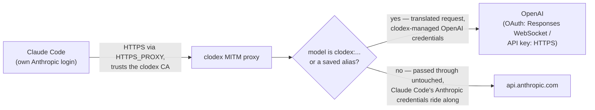
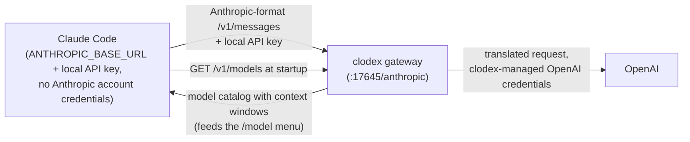

# clodex

[](https://www.npmjs.com/package/@bman654/clodex)

**clodex** lets you use your ChatGPT/Codex plan or OpenAI models with Claude Code as if they were Anthropic models.
You can use them anywhere you use Anthropic models like Opus and Sonnet — as the main session model, and in subagents, workflows, and agent teams. Clodex integrates them directly into Claude Code, using Claude Code's system prompt.
It works with your existing Claude Code plan as well as your Codex plans WITHOUT violating Anthropic's ToS.
No messing with CMUX or child codex processes or any of that stuff.
You can finally have Fable and Sol work together to solve the hardest problems.


You can also run clodex as a local OpenAI-compatible endpoint in front of your Codex plan, so any OpenAI-compatible client can use it.

> clodex is derived from the original [relay-ai](https://github.com/jacob-bd/relay-ai) project, heavily modified and streamlined for this one use case, with the full commit history preserved.

Contributions are welcome — see [CONTRIBUTING.md](./CONTRIBUTING.md) for how to scope a PR and what the quality bar is.

## Quick Start (ChatGPT/Codex plan)

```bash
npm install -g @bman654/clodex          # 1. install the CLI (Node 22+)
clodex providers auth openai   # 2. sign in with your ChatGPT/Codex plan (device-code OAuth)
clodex models                  # 3. pick favorite models and aliases
clodex models --alias sol=clodex:openai-oauth:gpt-5.6-sol
clodex models --alias luna=clodex:openai-oauth:gpt-5.6-luna
clodex models --alias terra=clodex:openai-oauth:gpt-5.6-terra
clodex patch                   # 4. (optional) patch Claude Code so those models are first-class
clodex claude                  # 5. launch Claude Code on an OpenAI model
```

1. **Install** — puts the `clodex` command on your PATH.
2. **Sign in** — opens a device-code OAuth flow for your ChatGPT/Codex plan; the token is stored in your OS credential store. (API-key users: `clodex providers add` instead.)
3. **Pick models** — an interactive manager for favorites (max 20) and short aliases like `sol` so you do not need to type the long names. Favorites drive the `/model` switch menu, proxy-mode routing, and the patcher.
4. **Patch** *(optional but recommended for proxy mode)* — bakes your favorites and aliases into the Claude Code binary so they pass model validation, appear in `/model`, and report their real context windows. Re-run after each `claude` update; `clodex patch --restore` undoes it. This step is required if you want to use your OpenAI models as subagents via the Agent tool.
5. **Launch** — starts Claude Code bridged to the model you choose.

## Difference between Clodex and other solutions

| Feature | Clodex | relay-ai | CLIProxyAPI | Various process-based solutions |
|--------|--------|----------|-------------|----|
| url       | https://github.com/bman654/clodex |  https://github.com/jacob-bd/relay-ai | https://help.router-for.me/ |    |
| Works with Claude Code Plans without violating Anthropic TOS | ✅ | ✅ | ❌ | ✅ |
| Can use all claude models + All Codex models together? | ✅ | ✅ | ❌ | ✅ |
| Claude Code aware of true model context window size | ✅ | ❌ | ❌ | n/a |
| Supports Agent tool | ✅ | ❌ | ✅ | ❌ |
| Supports use in Dynamic Workflows | ✅ | ✅ | ✅ | ❌ |
| OpenAI models use Claude Code skills/tools | ✅ | ✅ | ✅ | ❌ |
| OpenAI models use Claude Code system prompt | ✅ | ✅ | ✅ | ❌ |
| Supports use in skill/agent frontmatter | ✅ | ❌ | ✅ | ❌ |
| Supports OpenAI prompt caching | ✅ | ❌ | ? | ✅ |
| Uses Websockets to talk to OpenAI API | ✅ | ❌ | ? | ✅ |

### Claude Code Plans and ToS

It's important to understand that any tool that duplicates Claude Code's OAuth login flow violates Anthropic's Terms of Service
and risks getting your account banned.  Any tool that initiates a Claude Code OAuth flow from outside of the Claude Code app falls
into this category.

Another way to tell: if a tool needs you to set `ANTHROPIC_BASE_URL` to a custom value, Claude Code can't run on your plan credentials — so the only way that tool can use your plan is by duplicating Claude Code's OAuth flow, which is against the ToS.

Clodex avoids this. In proxy mode it uses an HTTP proxy to intercept requests bound for `api.anthropic.com`: requests for an Anthropic model pass through unmodified, still carrying Claude Code's own auth token untouched — your plan credentials are never duplicated or replaced.

## Bridge modes

Both `clodex claude` and `clodex server` support two bridge modes. A mode flag applies to **that run only**; to change a command's default, add `--save-mode` (e.g. `clodex claude --endpoint --save-mode`). With no flag and nothing saved, both commands default to **proxy** mode, which works with your existing Claude auth.

- **`--proxy`** (the default): a selective man-in-the-middle proxy for `api.anthropic.com`. Claude Code keeps its normal Anthropic login — Anthropic models work untouched — while models named `clodex:<provider-id>:<model-id>` (or their saved aliases) route to OpenAI. Switch with `/model clodex:openai-oauth:gpt-5.6-sol` or `/model sol` after patching.
- **`--endpoint`**: clodex runs a local Anthropic-format gateway and launches Claude Code with `ANTHROPIC_BASE_URL` pointed at it. All traffic goes through the gateway. With favorites saved, the gateway is multi-route and Claude Code's `/model` menu lists your starting model plus favorites for live switching.

> [!TIP]
> Proxy mode allows you to continue using your Claude Code plan: login to claude code like normal and the proxy will intercept requests and leave requests for Anthropic models untouched, while requests for your favorite OpenAI models will be re-routed to OpenAI.



In endpoint mode, no Anthropic account is involved — Claude Code is launched pointing at the local gateway with a local API key, and its startup `/v1/models` fetch powers the `/model` menu:



> [!TIP]
> Using Claude Code's agents view or background agents? Ask your Claude Code agent to read [docs/background-agents.md](docs/background-agents.md) and set it up for you — one global `clodex server --proxy` plus the `clodex-claude` wrapper bin bridges every claude process automatically.

## CLI reference

### `clodex claude [options] [claude-flags]`

Launch Claude Code bridged to OpenAI models. Unrecognized flags (and everything after `--`) pass through to Claude Code (`-c`, `--resume`, `--print`, …).

| Flag | Effect |
| --- | --- |
| `--endpoint` | Endpoint bridge mode for this run: local gateway + `ANTHROPIC_BASE_URL` |
| `--proxy` | Proxy bridge mode for this run: keep Claude Code's Anthropic auth; `clodex:` models route to OpenAI (default when nothing is saved) |
| `--save-mode` | With `--endpoint`/`--proxy`: save that mode as the `claude` default |
| `--dry-run` | Run the wizard but print a launch preview instead of launching (never persists anything) |
| `--trace` | Write debug logs to `~/.clodex/logs/` and show errors on exit |
| `--fast` | Request Codex fast mode (`service_tier=priority`) for ChatGPT/Codex OAuth routes; equivalent to `CLODEX_SERVICE_TIER=fast` |
| `--provider <id>` | Boot provider id (`openai` or `openai-oauth`); with `--model`, skips the wizard |
| `--model <id>` | Boot model id; with `--provider`, skips the wizard |
| `--help`, `--version` | Help / version |

Notes:

- Claude Code may save the launched model to `~/.claude/settings.json`, so bare `claude` later can still show a clodex model name. Reset with `claude --model sonnet`.
- Non-interactive stdin reuses your last provider/model instead of showing the wizard.

### `clodex server [options]`

Foreground gateway, same two bridge modes, no Claude Code launch — point any Anthropic-format (or OpenAI-format) client at it.

Common options (both modes):

| Flag | Effect |
| --- | --- |
| `--endpoint` | Endpoint mode for this run: Anthropic-format HTTP gateway |
| `--proxy` | Proxy mode for this run: selective `api.anthropic.com` MITM proxy (default when nothing is saved; local only) |
| `--save-mode` | With `--endpoint`/`--proxy`: save that mode as the `server` default |
| `--port <1-65535>` | Listen port (default 17645) |
| `--no-discovery` | Don't advertise this server in `~/.clodex/server-runtime.json` (`CLODEX_NO_DISCOVERY=1` also works). Use it for a standalone endpoint the `clodex-claude` wrapper should ignore. |
| `--ws-diagnostics` | Log sanitized request envelopes and WebSocket head decisions |
| `--help`, `--version` | Help / version |

Endpoint mode only (an error if combined with `--proxy`):

| Flag | Effect |
| --- | --- |
| `--quick`, `--saved` | Start immediately from saved/default settings, skipping the wizard |
| `--listen local\|network` | One-run listen mode override |
| `--providers all\|favorites\|id1,id2` | One-run provider catalog override |
| `--mask-gateway-ids` / `--no-mask-gateway-ids` | Mask or expose vendor names in discovery model ids (see below) |
| `--password <value>` | One-run network-mode server password |

Proxy mode has no extra options — it takes only the common options.

Bare `clodex server` uses the saved default mode (proxy if none saved). Proxy mode starts immediately. Endpoint mode on a TTY opens a short wizard — start from saved settings, or configure: favorites-only catalog?, which providers to expose, discovery-id masking, and listen local/network (network asks for a password). Without a TTY (or with `--quick`/any endpoint-mode option) it skips all prompts and starts from saved settings; network mode then needs a saved password or `--password`.

**`--mask-gateway-ids`:** endpoint-mode discovery ids look like `anthropic-openai-oauth__gpt-5.6`. Some Claude clients validate model names (Claude Desktop / Cowork pickers, Claude Code skill/agent `model:` frontmatter) and reject or filter ids containing non-Anthropic vendor names. Masking reverses the provider and model segments (`anthropic-htuao-ianepo__6.5-tpg`) so vendor strings never appear literally; display names stay readable (`GPT 5.6 (OpenAI)`). As the request `model`, the gateway accepts the masked id, the unmasked id, the canonical `clodex:<provider>:<model>` id, or a saved alias (e.g. `luna`) — and the response echoes back whichever id you sent. Tradeoff: masked ids are unreadable — copy them exactly from the printed catalog. Masking is on by default; use `--no-mask-gateway-ids` for clients that don't need it.

Endpoint-mode endpoints (default port 17645):

```
ANTHROPIC_BASE_URL=http://127.0.0.1:17645/anthropic
OPENAI_BASE_URL=http://127.0.0.1:17645/openai/v1
```

Use any API key locally; network mode requires the server password. Proxy mode prints `HTTPS_PROXY`, `HTTP_PROXY`, `NODE_EXTRA_CA_CERTS`, and adjusted `NO_PROXY` / `no_proxy` values to export. The adjusted bypass lists preserve unrelated hosts while ensuring `api.anthropic.com` reaches the selective proxy. Do **not** set `ANTHROPIC_BASE_URL` in that mode.

Several `clodex server` instances can run at once — each advertises itself in `~/.clodex/server-runtime.json`, and `clodex-claude` prefers a proxy-mode server (newest first) when bridging (see [docs/background-agents.md](docs/background-agents.md)). Pass `--no-discovery` to keep a server out of that file, e.g. a dedicated endpoint you point another tool at.

Examples:

```bash
# Endpoint gateway serving only your favorites, no prompts, for a local client
clodex server --endpoint --quick --providers favorites

# Proxy mode for an existing-auth Claude Code (export the env it prints)
clodex server --proxy
```

### `clodex patch`

Patch the installed Claude Code binary so clodex favorites and aliases are first-class: accepted by the Agent tool's model field, listed in `/model`, resolved to their real ids, and reporting the correct context window.

| Flag | Effect |
| --- | --- |
| `--restore` | Restore the pristine (unpatched) Claude Code binary |
| `--trace` | Show per-site `OK`/`SKIP`/`FAIL` results |
| `--enable-local-patches` | Persistently enable the fixed local patch module |
| `--disable-local-patches` | Disable local patches and rebuild from pristine bytes without them |
| `--help` | Help |

The patch map is built from your favorites and aliases; context windows come from provider metadata. A pristine per-version backup is kept, and a manifest (`~/.clodex/patch-state.json`) makes re-runs no-ops until your config or Claude Code version changes — then the binary is restored first and re-patched fresh. `clodex claude` checks patch freshness at launch and offers to re-patch (a non-blocking notice when not interactive). Re-run `clodex patch` after every `claude` update.

#### Local patches (trusted code)

Local patches are an explicitly enabled extension layer for private transforms that do not belong in clodex itself. Put one self-contained ES module at `~/.clodex/local-patches.mjs` (or `$CLODEX_HOME/local-patches.mjs`) and opt in with `clodex patch --enable-local-patches`. It must be a regular UTF-8 file no larger than 1 MiB. File presence alone never loads it.

Enabling this feature executes that JavaScript with your full user permissions; it is not sandboxed. Only use code you trust. Clodex never searches the current project, its installation, dependencies, or `node_modules` for patches.

The module must default-export an array. Each site has a unique lowercase `id` and an `apply` function that returns the complete source and emits the generated `marker` exactly once when it applies:

```js
export default [
  {
    id: 'example-site',
    apply(source, { marker }) {
      const anchor = 'exampleAnchor()';
      if (!source.includes(anchor)) return source;
      return source.replace(anchor, `${marker}${anchor}`);
    },
  },
];
```

Clodex hashes the captured module bytes into patch freshness, so editing the file triggers a pristine rebuild. The module is then applied after all built-in routing sites as one transaction: if any local site fails, every local change is discarded, the complete built-in patch still publishes, and `--trace` reports the failure. Local sites receive markers in the separate `/*clodex-local:...*/` namespace and cannot add, remove, or replace built-in `/*ccpatch:...*/` markers. Before publishing local output, Clodex compares exact postconditions captured from every successful built-in site and reruns the built-in verifier. Keep the module deterministic and self-contained; imported helper files are not part of its freshness identity.

### `clodex models` / `clodex favorites`

Manage favorite models (max 20) and short aliases. Favorites feed the endpoint-mode `/model` switch menu, proxy-mode routing, and the patcher. Saved to `~/.clodex/config.json`.

| Flag | Effect |
| --- | --- |
| *(none)* | Interactive manager: search all providers or browse one at a time |
| `--list` | Print the exact `clodex:<provider-id>:<model-id>` names (and aliases) without opening the manager |
| `--alias <name=target>` | Save a short name for a favorite, e.g. `--alias sol=clodex:openai-oauth:gpt-5.6-sol` (the `clodex:` prefix is optional in the target) |
| `--unalias <name>` | Remove a saved short name |
| `--help`, `--version` | Help / version |

### `clodex providers [subcommand]`

| Subcommand | Effect |
| --- | --- |
| *(none)* | Provider hub wizard |
| `add` | Add OpenAI with an API key (choose OAuth or API key) |
| `auth openai` | Sign in with ChatGPT/Codex-plan OAuth (device code) |
| `list` | Show configured providers |
| `remove <id>` | Remove a provider by id |
| `refresh-models [id]` | Update cached model lists |

Providers supported: `openai` (API key, platform.openai.com) and `openai-oauth` (ChatGPT/Codex plan).

### Root

```
clodex --help       # overview of all commands
clodex --version    # version
```

## Configuration

- Config home: `~/.clodex` (override with `CLODEX_HOME`). On first run, config is migrated automatically from a legacy `~/.relay-ai` directory if present; the legacy directory is never modified.
- The config-home filesystem and the native account home must support hard
  links because registry and credential locks are published atomically. Keep
  `CLODEX_HOME` and `~/.clodex/credential-locks` on local filesystems rather
  than FAT, exFAT, or a network mount that rejects hard links. An abrupt process
  kill during lock publication can leave a `*.lock.*.tmp` file; it does not
  block later lock acquisition and can be removed when no Clodex process is
  running. A canonical `providers.json.lock` whose recorded PID is no longer
  running is reclaimed automatically on the next lock acquisition. If it
  remains while that PID is active, stop every Clodex process and verify the
  recorded PID before removing the lock manually. Never remove the canonical
  lock while a Clodex process is active.
- Credentials live in the OS credential store (Keychain / Windows Credential
  Manager / Secret Service). The `clodex` service holds the main value or
  published marker; `clodex-chunks` holds current long-credential chunks;
  `clodex-journal` holds crash-recovery metadata and a deletion marker; and
  `clodex-deleted` holds a redundant non-secret deletion guard. A
  `clodex-state-key` entry protects each account's recovery metadata. Use
  Clodex provider removal instead of deleting these entries individually.
  Authenticated encrypted per-account managed-state markers live under the
  native OS account home at `~/.clodex/keyring-state`; before each journal
  write they record the exact recovery intent so a retry can replay and verify
  it. The encryption key remains in the OS credential store, so the filesystem
  marker alone cannot be used to test credential guesses. The marker also
  prevents a temporarily unavailable keyring journal from being mistaken for
  an absent one. If the OS credential store was completely reset, Clodex
  permits direct reauthorization only after sentinel checks prove the main and
  chunk namespaces are empty. Hidden, locked, or partially restored state
  remains fail-closed. Credential mutation locks live beside that state at
  `~/.clodex/credential-locks`. Both paths are independent of `CLODEX_HOME` and
  runtime or temporary-directory environment overrides. This keeps concurrent
  processes serialized when they use different config homes. Set
  `CLODEX_CREDENTIAL_HELPER` to an absolute executable path to use an external
  secure store instead; see [credential helpers](docs/credential-helpers.md).
- Proxied routes forward configured provider headers for API-key and OAuth authentication. Anonymous routes preserve non-credential headers while removing authorization, API-key, cookie, token, secret, and credential-bearing header names before dispatch.
- `CLODEX_CLAUDE_PATH` overrides Claude Code binary discovery.
- **Codex service tier:** `CLODEX_SERVICE_TIER` accepts `fast` (normalized to
  `priority`), `priority`, `flex`, `auto`, or `default`. Clodex requests the
  resolved value only after selecting a ChatGPT/Codex OAuth route; OpenAI
  API-key and non-OpenAI routes are unaffected. `clodex claude --fast` sets the
  value to `fast` for that invocation, overriding an ambient value, and composes
  the same environment before a dry-run preview. Request diagnostics record
  this pre-dispatch intent, not proof of wire serialization. If the provider
  SDK reports that it omitted the tier for a model, clodex warns once and the
  backend default remains in use.
- **Outbound proxy:** when `HTTP_PROXY`/`HTTPS_PROXY` (and optionally `NO_PROXY`) are set in clodex's environment, all clodex-originated network calls honor them — OAuth sign-in and token refresh, model-list and models.dev refreshes, upstream OpenAI API calls, and the ChatGPT/Codex OAuth WebSocket transport (tunneled via HTTP CONNECT).
- **Upstream retries:** set `CLODEX_UPSTREAM_MAX_RETRIES` to an integer from
  `0` through `5` to override the SDK's default of two retries for retryable
  provider failures. `0` disables retries. The SDK honors valid
  `retry-after`/`retry-after-ms` headers and otherwise uses exponential
  backoff. Larger integers clamp to `5` with a one-time warning because a sixth
  retry cannot complete before the translated streaming paths' 120-second
  no-data timeout. Unset, empty, or malformed values preserve the default. A
  stream that fails after output begins cannot be replayed safely and still
  terminates the request.

## Known limitations

- Cost display inside Claude Code is inaccurate for OpenAI models (Claude Code applies its own pricing table).
- In the endpoint-mode switch menu, the displayed context window reflects the launch model and does not update on live `/model` switches (Claude Code fetches window metadata once at startup). Proxy mode with `clodex patch` reports correct per-model windows.
- ChatGPT/Codex OAuth requires `store:false` upstream; some OpenAI cache controls are intentionally omitted on OAuth routes because they returned empty responses during compatibility testing.

## License

MIT — see [LICENSE](LICENSE).
